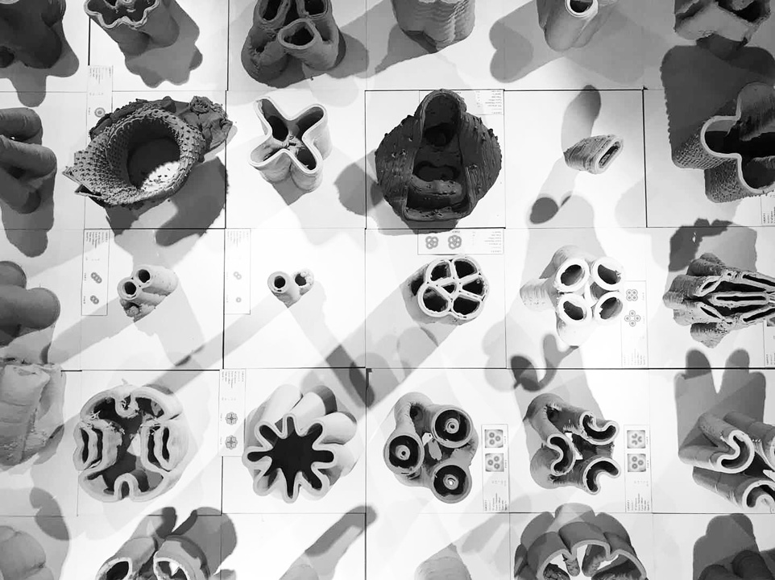
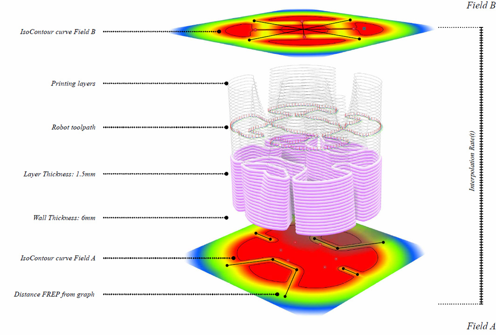
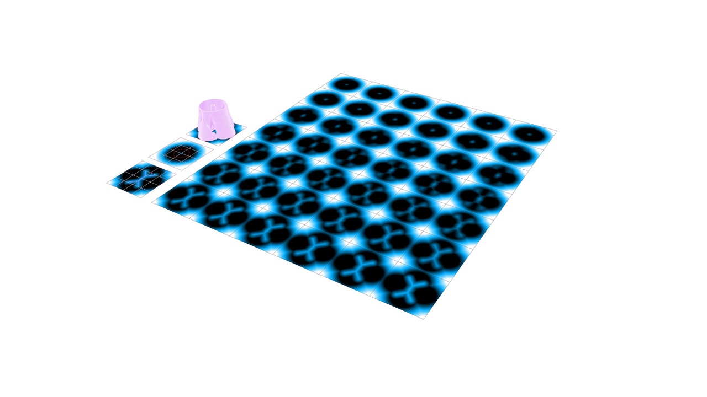
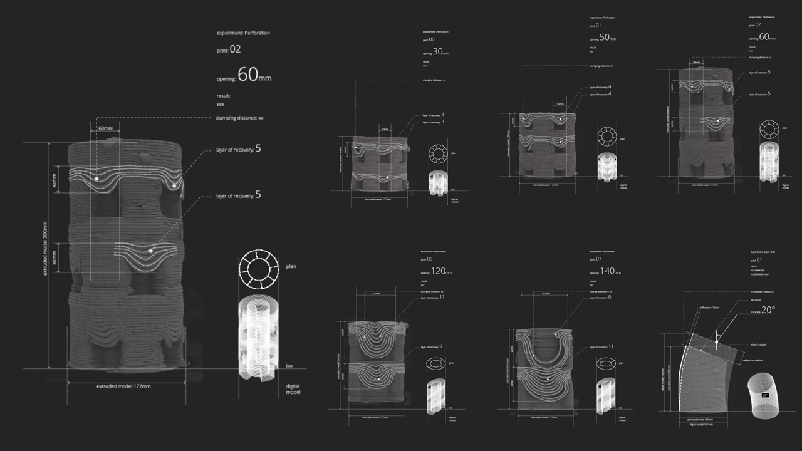

# Print Fast Pile High V2
(Previously Cyborg)

## Introduction
This is a Grasshopper plugin developed for a series of workshops titled "Print Fast Pile High", an offshoot from design research and material experimentation on 3D-printing conducted at the AADRL and Shajay Bhooshan's PhD research on concrete additive manufacturing.
The workshop is a collaborative design-build exercise which seeks synergies between computational masonry and 3D printing with soft-rigid materials. 
The aim is to explore geometries which are structurally aware and their associated design space, in relation to their materiality and fabrication technology.
Clay is used as material and its dominant compression capacity is the main parameter to explore and use to design digital geometries accordingly. 
Traditional layer-by-layer 3d printing methods is questioned in favor of a methodology which aligns geometric representation in digital space with the physical manufacturing process. Function Representations (F-Rep) and image based technology is employed to generate digital geometries with a custom toolkit before to be translated into robotic instructions for the physical world.
 

## Features
The plugin implements the SDF function approach to generate 3D-printable forms outlined in the paper _Function Representation for Robotic
3D Printed Concrete_ (Bhooshan 2018).
* Blending, boolean and plane trimming operations to manipulate field functions. 
* Multi-threading for calculation-intensive components.
* Display components to visualize geometric output.

## Development
The project is currently considered completed.

## Technologies
Spatial Slur https://github.com/daveReeves/SpatialSlur
## Setup
Compile in Visual Studio as Grasshopper Assembly. For adding plugins in Grasshopper please refer to official documentation. 

## References

https://block.arch.ethz.ch/brg/files/BHOOSHAN_2018_ROBARCH_function-representation-robotic-3D-printed-oncrete_1535622320.pdf
